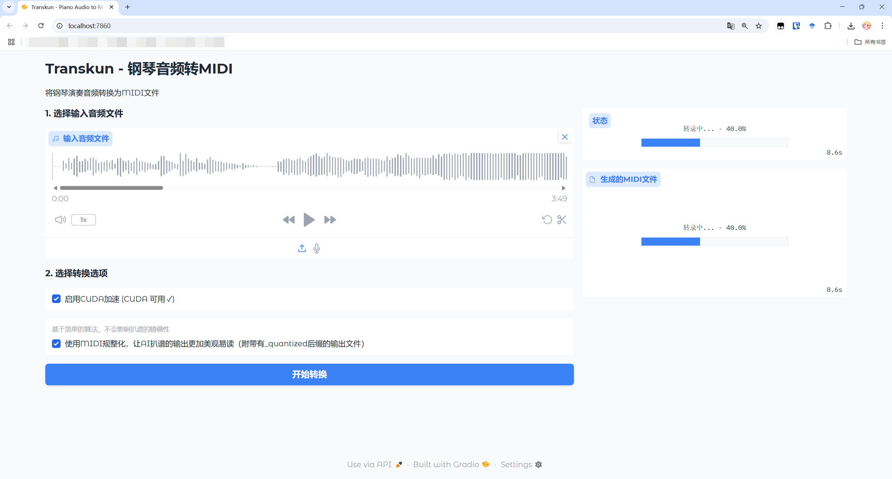

# TranskunGUI: Gradio-based GUI for Piano Transcription Using Transkun

## Demo



## About

This repo contains a simple GUI implementation for piano transcription using Gradio framework, based on the following research:

> Yujia Yan and Zhiyao Duan, Scoring intervals using non-hierarchical transformer for automatic piano transcription, in Proc. International Society for Music Information Retrieval Conference (ISMIR), 2024, [Paper](https://arxiv.org/abs/2404.09466)

> Yujia Yan, Frank Cwitkowitz, Zhiyao Duan, Skipping the Frame-Level: Event-Based Piano Transcription With Neural Semi-CRFs, Advances in Neural Information Processing Systems, 2021, [OpenReview](https://openreview.net/forum?id=DGA8XbJ8FVd), [Paper](https://openreview.net/pdf?id=DGA8XbJ8FVd), [Appendix](https://openreview.net/attachment?id=DGA8XbJ8FVd&name=supplementary_material)

This project is built upon and acknowledges the [Yujia-Yan/Transkun](https://github.com/Yujia-Yan/Transkun) repository.

Using this GUI, you can transcribe piano recordings into MIDI files with an intuitive interface.

## Requirements

- **OS**: Windows 7 or later (64-bit), macOS
- **Memory**: At least 4GB RAM

## How to Use

1. Run the application.
2. Select audio or video files using the GUI interface.
3. (Optional) Choose an output directory for the transcribed MIDI files.
4. If you do not select an output path, the MIDI file will be saved by default in the same directory as the input file, with the same name but a `.mid` extension.

## Building from Source

### Windows

```bash
pyinstaller --onefile --windowed --name TranskunGUI ^
    --add-data="models;models" ^
    --add-data="C:\path\to\Python\Lib\site-packages\transkun;transkun" ^
    --add-binary="ffmpeg_bin\ffmpeg.exe;ffmpeg_bin" ^
    --add-binary="ffmpeg_bin\ffprobe.exe;ffmpeg_bin" ^
    --hidden-import=mir_eval ^
    .\main.py
```

### macOS

```bash
pyinstaller --onefile --windowed --name TranskunGUI \
    --add-data="models:models" \
    --add-data="/Users/lollikit/.pyenv/versions/3.10.13/lib/python3.10/site-packages/transkun:transkun" \
    --hidden-import=mir_eval \
    ./main.py
```

> **Note**
>
> - Please modify paths according to your actual environment.
> - Windows uses `;` as path separator, macOS uses `:`.
> - If including ffmpeg, ensure the binary file paths are correct.
