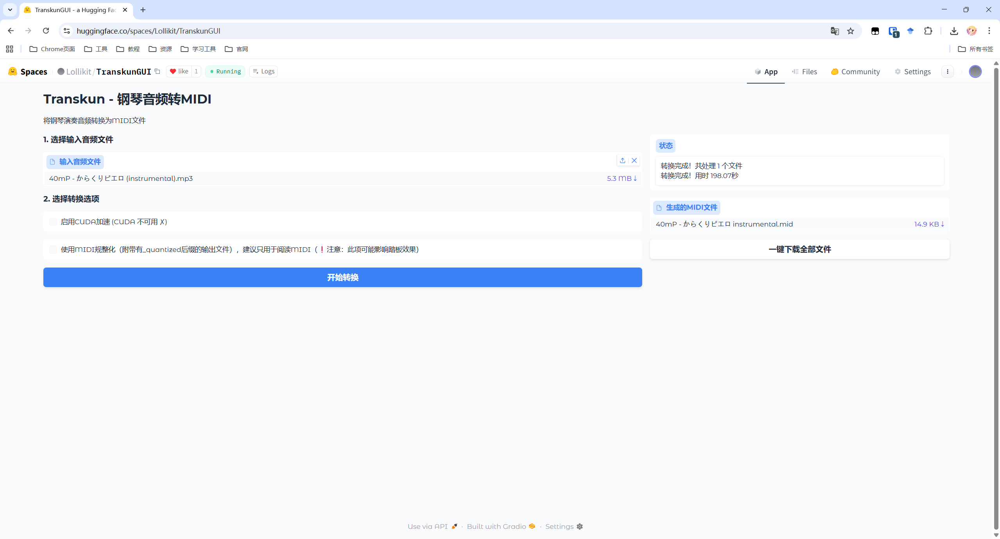

# TranskunGUI: Gradio-based GUI for Piano Transcription Using Transkun

预计我会持续维护这个项目，如果有问题欢迎通过Bilibili联系我。如果对您有帮助，希望能够给一个小小的Star，这是对我的最大的支持！

If you find this project helpful, feel free to give it a star!

## Demo

现已提供Huggingface Space试用版本，访问 [Huggingface Space](https://huggingface.co/spaces/Lollikit/TranskunGUI) 即可体验！（由于使用免费的CPU，速度可能稍慢，大约一首歌2-3分钟）

A new Huggingface Demo is available! Try it with [Huggingface Space](https://huggingface.co/spaces/Lollikit/TranskunGUI)! (Using free CPU, may be slow)

## Usage

请访问 [Release 页面](https://github.com/natsunoshion/TranskunGUI/releases) 下载最新版本。

Please visit the [Release page](https://github.com/natsunoshion/TranskunGUI/releases) to download the latest version.

## About

This repo contains a simple GUI implementation for piano transcription using Gradio framework, based on the following research:

> Yujia Yan and Zhiyao Duan, Scoring intervals using non-hierarchical transformer for automatic piano transcription, in Proc. International Society for Music Information Retrieval Conference (ISMIR), 2024, [Paper](https://arxiv.org/abs/2404.09466)

> Yujia Yan, Frank Cwitkowitz, Zhiyao Duan, Skipping the Frame-Level: Event-Based Piano Transcription With Neural Semi-CRFs, Advances in Neural Information Processing Systems, 2021, [OpenReview](https://openreview.net/forum?id=DGA8XbJ8FVd), [Paper](https://openreview.net/pdf?id=DGA8XbJ8FVd), [Appendix](https://openreview.net/attachment?id=DGA8XbJ8FVd&name=supplementary_material)

This project is built upon and acknowledges the [Yujia-Yan/Transkun](https://github.com/Yujia-Yan/Transkun) repository.

Using this GUI, you can transcribe piano recordings into MIDI files with an intuitive interface.

## Requirements

- **OS**: Windows 7 or later (64-bit), macOS
- **Memory**: At least 4GB RAM

## How to Use

1. Run the application.
2. Select audio or video files using the GUI interface.
3. (Optional) Choose an output directory for the transcribed MIDI files.
4. Transcribe now!

## Building from Source

For building from source, please refer to the instructions in [Pyinstaller](https://pyinstaller.org/en/stable/). Use `TranskunGUI.spec` in this repository.
